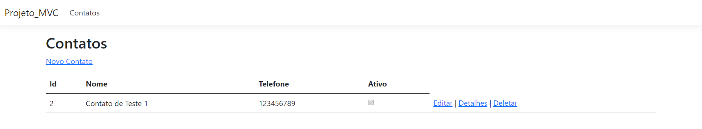

<h1 align="center"> CRUD .NET | MVC</h1>

## ✨ Tecnologias

Esse projeto foi desenvolvido com as seguintes tecnologias:

- HTML
- CSS
- .NET | C#
- JavaScript

## 💻 Projeto

Esse é um pequeno CRUD realizado no bootcamp Pottencial disponibilizado pela Digial Innovation One. O desafio da vez era criar um projeto usando o padrão MVC do pacote do Entity Framework

## 🚀 Como executar

- Clone o repositório
- Build seu projeto
- Aplique as migrations

## 🎆 Segue um exemplo do menu principal

  

## 📧 Contatos

  
  

